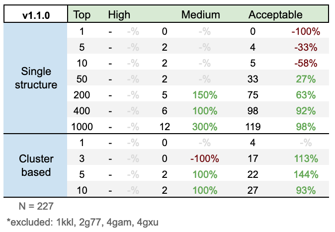

[](https://github.com/rvhonorato/gdock/releases/tag/v1.1.0)
[](https://opensource.org/licenses/0BSD)
[](https://travis-ci.com/rvhonorato/gdock)
[](https://www.codacy.com/gh/rvhonorato/gdock/dashboard?utm_source=github.com&utm_medium=referral&utm_content=rvhonorato/gdock&utm_campaign=Badge_Coverage)
[](https://www.codacy.com/gh/rvhonorato/gdock/dashboard?utm_source=github.com&utm_medium=referral&utm_content=rvhonorato/gdock&utm_campaign=Badge_Grade) 


_Genetic Algorithm applied to Protein-Protein Docking_

## tl:dr

-   [Installation](INSTALLATION)
-   [How-to-use](example/README)

## Disclaimer

Despite having some knowledge in Genetic Algorithms I am not an expert. If you are an expert any suggestions or critics are welcome. (:


## Methods

In `gdock` we apply a [Genetic Algorithm](https://en.wikipedia.org/wiki/Genetic_algorithm) to Protein-Protein docking. Here, each individual is represented by its cartesian coordinates and euler angles, and the fitness of each conformation is given by the ratio of satisfied restraints are satisfied.

The input of each simulation is two [PDB files](https://pdb101.rcsb.org/learn/guide-to-understanding-pdb-data/introduction), plus a list of residues that are likely to play a part in the interaction. There are many ways one can obtain such residues, from theorethical predictions to _in vitro_ experiments. `gdock` does not support _ab initio_ docking.

During spatial sampling, the receptor is fixed in space and all geometric opertions are be done to the ligand. Each individual (=conformation) is generated by randomly assigning three floats that will describe a region in space around the geometric center of the initial ligand positioning (in a range of ± 5Å) and three more floats that will describe its rotation (0-360). 

The fitness of each one of these individual is evaluated as a ratio of how many of the inputted restraints are in contact. Over each generation, individuals have a chance of mutation, where one of the six descriptors is randomly changed and also a chance of crossover, where individuals exchange descriptors.

The generations are stopped after it "converges" (mean variation > 0.1 over 3 generations) and the binding energy of _all_ conformations are calculated with `DComplex`. The conformations are ranked according to the `gdock_score` which is given simply by: 

```python
gdock_score = energy / restraint_satisfaction
```

Only the top 1000 structures are clustered using according to their [frequency of common contacts](https://github.com/haddocking/FCC) with `cutoff=0.6`. 

Once the simulation is done, the run directory is cleaned to preserve disk space and a data-processing friendly file is written in `analysis/gdock.dat`

## Benchmark

The accuracy of a docking software can be measured by its ability to reconstruct experimentally determined structures. The dataset most used for such benchmarking is the Protein-Protein Docking Benchmark v5 (BM5) ([10.1016/j.jmb.2015.07.016](https://www-sciencedirect-com.proxy.library.uu.nl/science/article/pii/S0022283615004180)). 

A `gdock` run was done for each of the complexes of BM5, using the _unbound_ forms of the ligand and the receptor as input, and calculating the interface root mean square (i-RMSD) variation of the resulting complexes against the _bound_ form. The restraints used in the benchmark are the _true-interface_, defined as the aminoacids that are observed in the _bound_ interface. These restraints can be interpreted as the perfect scenario, thus ideal to measure `gdock` perfomance.

According to the [_Critical Assessment of PRediction of Interactions_](https://www.ebi.ac.uk/pdbe/complex-pred/capri/) (CAPRI) parameters, comlexes can be categorized as `High`, `Medium` or `Acceptable` according to its (i-RMSD):

    i-RMSD <= 1 - High
    i-RMSD <= 2 - Medium
    i-RMSD <= 4 - Acceptable

### Success rate

 **Single-structue**: For each target in the benchmark, we could rank the generated complexes according to its score and, for example, analyse only the _top 5_ conformations. If _at least one_ of these conformations has `i-RMSD <= 2`, this target's success will be considered `Medium`. 

 **Cluster-based**: Once the clusters are sorted by fitness and we consider, for example, the _top5_ models of the top 1, 3, 5 or 10 clusters. Same logic as the single-structure analysis is applied.

### Results

The results for `v1.1.0` are as follows, the % shows the increase/decrease in relation the previous version.



_Note: Some conformations were excluded since dcomplex could not be executed on them._

### Discussion

Unfortunately, no `High` ranking conformations were obtained and there was a decrease in success rate for top 1, 5 and 10. Even tho the exact reasons for this behaviour are not certain, there are a few possibilities: 1) the scoring function is not perfoming well at positioning the "best" conformations in the top rankings, 2) the range of spatial exploration might be too large or 3) the lack of flexibility during docking is affecting the success rate.

A notable increase (300%!) in success rates is observed for the top 200, 400 and 1000 both in `Medium` and `Acceptable` ranking, when comparing the benchmark results with the previous version. This comes mostly due to the inclusion of the restraint satisfaction as a score term however these results indicate that the scoring function can still be improved.

As a better scientists said before me:

> Scoring is the holy grail of docking!

_Note: All relevant benchmarking data are kept in a [different repository](http://github.com/rvhonorato/gdock-benchmark)._

## Collaboration / Development

If you would like to help or improve your python coding skills, `gdock` might be a good project to work on!

The code is licensed under a 0-clause license ([0BSD](LICENSE)), which pretty much means you can do whatever you want with it; copy, edit, deploy, distribute or even sell. :nerd_face:

As for my vision to the project, there's a small [TODO list](CONTRIBUTING).

## Installation

Check [INSTALLATION.md](INSTALLATION.md)

## How-to-use

Check the provided [example](example/README)

* * *

:octopus:
