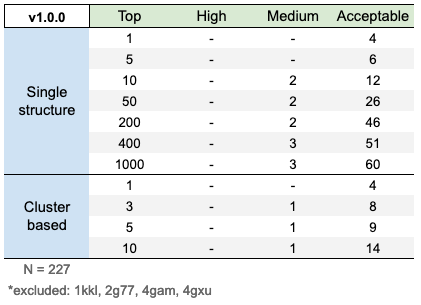

[](https://github.com/rvhonorato/gdock/releases/tag/v1.0.0)
[](https://doi.org/10.5281/zenodo.4467795)
[](http://creativecommons.org/publicdomain/zero/1.0/)
[](https://travis-ci.com/rvhonorato/gdock)
[](https://www.codacy.com/gh/rvhonorato/gdock/dashboard?utm_source=github.com&amp;utm_medium=referral&amp;utm_content=rvhonorato/gdock&amp;utm_campaign=Badge_Coverage)
[](https://www.codacy.com/gh/rvhonorato/gdock/dashboard?utm_source=github.com&utm_medium=referral&utm_content=rvhonorato/gdock&utm_campaign=Badge_Grade) 


_Genetic Algorithm applied to Protein-Protein Docking_

## License

This project licensed is the Creative Commons 0 ([CC0](https://creativecommons.org/publicdomain/zero/1.0/legalcode)) - “No Rights Reserved”  

> By marking the work with a CC0 public domain dedication, the creator is giving up their copyright and allowing reusers to distribute, remix, adapt, and build upon the material in any medium or format, even for commercial purposes. 


_Be warned that the third-party dependencies used here have different licenses._

## Disclaimer

I am by no means an expert in genetic algorithms, and do not aspire this software to compete with any of the tens of dozens similar software out there. It was idealized as an exercise in programming, to test a few concepts and as a quarentine project.

I am also aware that there is still very much to be done and improved, so far this is a one-man show. Check the [CONTRIBUTING.md](CONTRIBUTING.md) if you would like to help/criticize (:

## Concept

In the project we apply [Genetic Algorithm](https://en.wikipedia.org/wiki/Genetic_algorithm) to protein-protein docking. Each individual is represented by its cartesian coordinates and euler angles, and the fitness of each conformation is given by a scoring function.

The input of each simulation is two [PDB files](https://pdb101.rcsb.org/learn/guide-to-understanding-pdb-data/introduction), one receptor and one ligand; plus a list of residues that are likely to play a part in the interaction. There is (and probably will never be) support for _ab initio_ experiments.

Initial placement of the molecule is done in a way that each of the interface composed by residues that are likely to be in the interface are facing each other. From here on, the receptor is fixed in space and all geometric opertions are be done to the ligand. Each individual (=conformation) is generated by randomly assigning three floats that will describe a region in space (around the geometric center of the initial ligand positioning) and three more floats that will describe its rotation. 

The fitness of each one of these individual is evaluated (=scored) and over each generation, individuals have a chance of mutation, where one of the six descriptors is randomly changed and also a chance of crossover, where individuals exchange descriptors.

## Installation

Check [INSTALLATION.md](INSTALLATION.md)

## How-to-use

```bash
$ conda activate gdock
(gdock) $ python gdock/gdock.py run.toml
```

Check the [`examples/`](examples/) folder

## Benchmark

The accuracy of a docking software can be measured by its ability to reconstruct experimentally determined structures. This can be done using the Protein-Protein Docking Benchmark v5 ([10.1016/j.jmb.2015.07.016](https://www-sciencedirect-com.proxy.library.uu.nl/science/article/pii/S0022283615004180)). To setup the benchmark, clone the [BM5-clean](https://github.com/haddocking/BM5-clean) repository and use the `*-benchmark.py` scripts in `tools/`; by default it will use the true-interface as restraints and use the unbound structures as input and the bound conformation as the native model.

The resulting complexes are analyzed according to the [_Critical Assessment of PRediction of Interactions_](https://www.ebi.ac.uk/pdbe/complex-pred/capri/) (CAPRI) parameters, specifically the interface root mean square deviation (i-RMSD). This metric is used to evaluate the success rate of _gdock_ in different subsets of generated solutions. 

-   `i-RMSD <= 1` == High
-   `i-RMSD <= 2` == Medium
-   `i-RMSD <= 4` == Acceptable

Single-structure analysis; for each target in the benchmark, we could rank the generated complexes according to its fitness and, for example, analyse only the _top 5_ conformations. If _at least one_ of these conformations has `i-RMSD <= 2`, this target's success will be considered `Medium`. 

Cluster-based; here the clusters are sorted by fitness and we consider the top5 models of the top 1, 3, 5 or 10 clusters. Same logic as the single-structure analysis is applied.

The results for v1.0.0 are as follows:



_Note: Some conformations were excluded since dcomplex could not be executed on them._

### But what does this means?

In layman's terms it means that the perfomance is currently very bad. 

For you to get `Acceptable` conformations would you need to check 1000 structures, and only for 60 cases. The low perfomance is also observed in the cluster based analysis. The expected scenario is that as many cases as possible are in the `High` category and within the smallest subset. 

In summary: the opposite of what is happening here.

## Future work

There are many reasons for such bad perfomance, to address it the following work would be needed (and not limited to):

-   <ins>Add flexibility</ins>; currently it is doing rigid-body docking
-   <ins>Optimize the many Genetic Algorithm parameters</ins>; currently its using the ones I choose based on gut feeling (:
-   <ins>Code optimization</ins>; the simulation time could (hopefully) be decreased with some smart code optimizations

:octopus:
