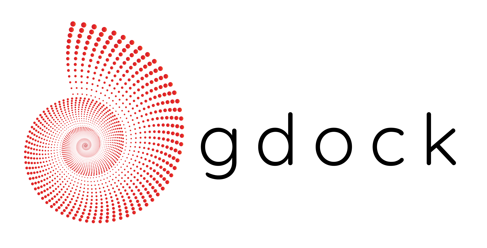

# gdock

**Information-driven protein-protein docking using a genetic algorithm**

[](https://doi.org/10.5281/zenodo.18863556)

[](https://github.com/rvhonorato/gdock/actions/workflows/ci.yml)
[](https://app.codacy.com/gh/rvhonorato/gdock/dashboard)



> **The main source repository has moved to
> [Codeberg](https://codeberg.org/rvhonorato/gdock).** GitHub remains available
> as a mirror; please open issues and pull requests on Codeberg.

gdock is a fast protein-protein docking tool written in Rust that uses
restraints and energy components to guide the docking process. It combines a
genetic algorithm with physics-based scoring to find optimal protein-protein
complexes.

> A paper describing gdock has been submitted to and is waiting review in the
> [Journal of Open Source Software (JOSS)](https://joss.theoj.org/).

## Features

- **Fast**: Genetic algorithm with early stopping and elitism
- **Information-driven**: Uses residue restraints to guide docking
- **Flexible scoring**: Configurable energy weights (VDW, electrostatics,
  desolvation, restraints)
- **Quality metrics**: Optional DockQ calculation when reference structure is
  provided
- **Clustering**: FCC-based clustering to group similar solutions
- **Sampling**: Collect a large pool of unique diverse conformations with `--sampling`

## Web Interface

A web interface is available at [gdock.org](https://gdock.org) for running
docking jobs without installing anything locally.

## Quick Start

```bash
# Install
cargo install gdock

# Prepare some input data
curl -sL https://files.rcsb.org/download/2OOB.pdb -o 2OOB.pdb
awk '/^ATOM/ && substr($0,22,1)=="A"' 2OOB.pdb > 2oob_A.pdb
awk '/^ATOM/ && substr($0,22,1)=="B"' 2OOB.pdb > 2oob_B.pdb

# Run docking
gdock run \
  --receptor 2oob_A.pdb \
  --ligand 2oob_B.pdb \
  --restraints 933:6,936:8,940:42,941:44,946:45,950:46
```

Most docking runs complete in ~15 seconds on standard hardware.

## Installation

```bash
cargo install gdock
```

Or build from source:

```bash
git clone https://codeberg.org/rvhonorato/gdock
cd gdock
cargo build --release
```

Requires [Rust](https://www.rust-lang.org/tools/install) 1.70 or later.

## Usage

`gdock` has three subcommands: `run`, `score`, and `restraints`.

### Docking (`run`)

Run the full genetic algorithm docking:

```bash
gdock run \
  --receptor receptor.pdb \
  --ligand ligand.pdb \
  --restraints 933:6,936:8,940:42
```

With a reference structure for DockQ calculation:

```bash
gdock run \
  --receptor receptor.pdb \
  --ligand ligand.pdb \
  --restraints 933:6,936:8,940:42 \
  --reference native.pdb
```

Additional options:

- `-o, --output-dir <DIR>`: Output directory (default: current directory)
- `-n, --nproc <NUM>`: Number of processors (default: total - 2)
- `--no-clust`: Disable clustering
- `--sampling <NUM>`: Collect up to NUM unique poses sorted by fitness into `sampling/`
- `--w_vdw`, `--w_elec`, `--w_desolv`, `--w_air`: Custom energy weights

#### Sampling mode

Use `--sampling N` to collect a large pool of diverse conformations from a single
GA run. This is useful when you need more than the default 5 output models — for
example, to feed a downstream selection step:

```bash
gdock run \
  --receptor receptor.pdb \
  --ligand ligand.pdb \
  --restraints 933:6,936:8,940:42 \
  --sampling 500
```

All unique conformations discovered by the GA (up to N) are written to
`sampling/gdock_1.pdb`, `sampling/gdock_2.pdb`, … sorted by fitness (best first),
alongside a `sampling/sampling.tsv` with per-model scores and energy components.
The normal `model_*.pdb` / `ranked_*.pdb` output is still produced.

### Scoring (`score`)

Calculate energy components without running the GA:

```bash
gdock score \
  --receptor receptor.pdb \
  --ligand ligand.pdb \
  --restraints 933:6,936:8,940:42
```

### Generate restraints (`restraints`)

Generate restraints from interface contacts in a native structure:

```bash
gdock restraints \
  --receptor receptor_ref.pdb \
  --ligand ligand_ref.pdb \
  --cutoff 5.0
```

## Command reference

```
$ gdock -h
Fast information-driven protein-protein docking using genetic algorithms

Usage: gdock <COMMAND>

Commands:
  run         Run the genetic algorithm docking
  score       Score structures without running the GA
  restraints  Generate restraints from interface contacts
  help        Print this message or the help of the given subcommand(s)

Options:
  -h, --help     Print help
  -V, --version  Print version
```

```
$ gdock run -h
Run the genetic algorithm docking

Usage: gdock run [OPTIONS] --receptor <FILE> --ligand <FILE> --restraints <PAIRS>

Options:
  -r, --receptor <FILE>     Receptor PDB file
  -l, --ligand <FILE>       Ligand PDB file
      --restraints <PAIRS>  Comma-separated restraint pairs receptor:ligand (e.g., 10:45,15:50)
      --reference <FILE>    Reference PDB file for DockQ calculation
      --debug               Debug mode: use DockQ as fitness (requires --reference)
  -o, --output-dir <DIR>    Output directory for results (default: current directory)
      --no-clust            Disable clustering, output best_by_score and best_by_dockq only
  -n, --nproc <NUM>         Number of processors to use (default: total - 2)
      --sampling <NUM>      Collect up to NUM unique poses sorted by fitness into sampling/
      --w_vdw <WEIGHT>      Weight for VDW energy term
      --w_elec <WEIGHT>     Weight for electrostatic energy term
      --w_desolv <WEIGHT>   Weight for desolvation energy term
      --w_air <WEIGHT>      Weight for AIR restraint energy term
  -h, --help                Print help
```

```
$ gdock score -h
Score structures without running the GA

Usage: gdock score [OPTIONS] --receptor <FILE> --ligand <FILE>

Options:
  -r, --receptor <FILE>     Receptor PDB file
  -l, --ligand <FILE>       Ligand PDB file
      --restraints <PAIRS>  Comma-separated restraint pairs receptor:ligand (optional)
      --reference <FILE>    Reference PDB file for DockQ calculation
      --w_vdw <WEIGHT>      Weight for VDW energy term
      --w_elec <WEIGHT>     Weight for electrostatic energy term
      --w_desolv <WEIGHT>   Weight for desolvation energy term
      --w_air <WEIGHT>      Weight for AIR restraint energy term
  -h, --help                Print help
```

```
$ gdock restraints -h
Generate restraints from interface contacts

Usage: gdock restraints [OPTIONS] --receptor <FILE> --ligand <FILE>

Options:
  -r, --receptor <FILE>     Receptor PDB file
  -l, --ligand <FILE>       Ligand PDB file
      --cutoff <ANGSTROMS>  Distance cutoff for interface detection (default: 5.0)
  -h, --help                Print help
```

## Input Format

### PDB Files

- **Receptor**: PDB file containing the receptor protein (single chain)
- **Ligand**: PDB file containing the ligand protein (single chain)
- **Reference** (optional): PDB file containing the native complex

### Restraints

Comma-separated list of residue pairs in `receptor:ligand` format:

```text
933:6,936:8,940:42
```

These indicate which residues should be in contact, based on experimental data
or other information sources.

## Output

- `model_X.pdb`: Cluster representatives (unless `--no-clust`)
- `ranked_X.pdb`: Top 5 models ranked by score
- `metrics.tsv`: Tab-separated file with scores and metrics
- `sampling/gdock_N.pdb`: All unique poses sorted by fitness (only with `--sampling`)
- `sampling/sampling.tsv`: Scores and energy components for sampling output

Output structures can be visualized with molecular viewers such as
[PyMOL](https://pymol.org/) or [ChimeraX](https://www.cgl.ucsf.edu/chimerax/).

## Algorithm

gdock uses:

- **Genetic Algorithm**: Population of 150, elitism (top 5), tournament
  selection
- **Energy Function**: VDW + Electrostatics + Desolvation + AIR restraints
- **Restraints**: Flat-bottom potential (0-7 Angstrom) for specified residue pairs
- **Early Stopping**: Converges when no improvement for 10 generations
- **Clustering**: FCC-based clustering of final population

## Testing

Run the test suite:

```bash
cargo test
```

The test suite includes 174 tests covering parsing, energy calculations, and
algorithm behavior.

## Relevant repositories

- [`gdock-benchmark`](https://github.com/rvhonorato/gdock-benchmark): repository
containing all scripts and raw data relevant to benchmarking the performance
of `gdock`
- [`gdock-wasm`](https://github.com/rvhonorato/gdock-wasm): WebAssembly bindings
used in [gdock.org](https://gdock.org)

## Contributing

Contributions are welcome! Please feel free to submit issues and pull requests
on [Codeberg](https://codeberg.org/rvhonorato/gdock).

Before submitting a pull request, please ensure:

- All tests pass (`cargo test`)
- Code is formatted (`cargo fmt`)
- Linting passes (`cargo clippy`)

## Citation

If you use gdock in your research, please cite:

- Vargas Honorato, R. gdock: Information-Driven Protein-Protein Docking Using a Genetic Algorithm. (Zenodo, 2026). doi:[10.5281/zenodo.18863557](https://doi.org/10.5281/zenodo.18863557). 

[_A JOSS paper has been submitted and is waiting for review_](https://gdock.org/gdock_paper_submitted.pdf).

## License

BSD Zero Clause License. See [LICENSE](LICENSE) file.
