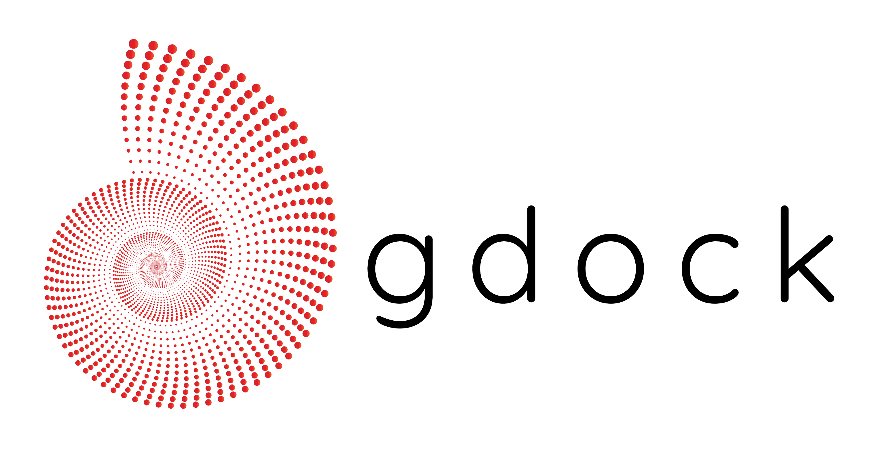

# gdock 🦀
**Information-driven protein-protein docking using a genetic algorithm**

[](https://github.com/gdocking/gdock/actions/workflows/ci.yml)


[](https://app.codacy.com/gh/gdocking/gdock/dashboard?utm_source=gh&utm_medium=referral&utm_content=&utm_campaign=Badge_grade)

## IMPORTANT

🚧 `gdock` is currently undergoing a full Rust-rewrite 🚧

In its current state it is **not yet production ready**! The code still needs to be reviewed and the protocol needs to be benchmarked.

The older v1.1.0 python version is still available in the releases.

---



gdock is a fast, efficient protein-protein docking tool written in Rust that uses restraints and energy components to guide the docking process. It combines a genetic algorithm with physics-based scoring to find optimal protein-protein complexes.

## Features

- 🚀 **Fast**: Genetic algorithm with early stopping and elitism
- 🎯 **Information-driven**: Uses residue restraints to guide docking
- 📊 **Flexible scoring**: Configurable energy weights (VDW, electrostatics, desolvation, restraints)
- 📈 **Quality metrics**: Optional DockQ calculation when reference structure is provided
- 🦀 **Rust-powered**: Memory-safe and high-performance

## Installation

```bash
git clone https://github.com/gdocking/gdock
cd gdock
cargo build --release
```

The binary will be available at `./target/release/gdock`.

## Usage

### Basic Usage (Docking Mode)

Run the full genetic algorithm docking:

```bash
gdock \
  --receptor data/A.pdb \
  --ligand data/B.pdb \
  --restraints 933:6,936:8,940:42,941:44,946:45,950:46
```

This will:
- Dock the ligand onto the receptor using the genetic algorithm
- Use the specified residues to create restraints
- Optimize based on energy scoring
- Output `best_by_score.pdb`

### With Reference Structure (DockQ Mode)

When you have a reference/native structure for validation:

> This is only useful in parametrization scenarios or when you are comparing `gdock`.
>  Since in a real scenario you will not have the actual reference.

```bash
gdock \
  --receptor data/A.pdb \
  --ligand data/B.pdb \
  --restraints 933:6,936:8,940:42,941:44,946:45,950:46 \
  --reference data/2oob.pdb
```

This will:
- Calculate DockQ, RMSD, iRMSD, and FNAT during optimization
- Output both `best_by_score.pdb` and `best_by_dockq.pdb`

### Score-Only Mode

Calculate energy components without running the GA:

```bash
gdock \
  --receptor data/A.pdb \
  --ligand data/B.pdb \
  --restraints 933:6,936:8,940:42,941:44,946:45,950:46 \
  --score
```

This will quickly compute VDW, electrostatic, desolvation, and AIR energies for the given complex.

### Custom Energy Weights

```bash
gdock \
  --receptor data/A.pdb \
  --ligand data/B.pdb \
  --restraints 933:6,936:8,940:42,941:44,946:45,950:46 \
  --w_vdw 1.0 \
  --w_elec 0.5 \
  --w_desolv 0.1 \
  --w_air 100.0
```

## Input Format

### PDB Files
- **Receptor**: PDB file containing the receptor protein (single chain)
- **Ligand**: PDB file containing the ligand protein (single chain)
- **Reference** (optional): PDB file containing the native complex (both chains)

### Restraints
- Colon-separated list of pairs of residue numbers in `receptor:ligand` format: `933:6,936:8`, etc
- Indicates which residues should be part of the interaction, based on experimental data or other information source
- Creates all pairwise restraints between receptor and ligand residues
- More restraints = stronger guidance but may be restrictive!

## Output

- `best_by_score.pdb`: Complex with the best energy score
- `best_by_dockq.pdb`: Complex with the best DockQ (only with `--reference`)

## Algorithm

gdock uses:
- **Genetic Algorithm**: Population of 150, elitism (top 5), tournament selection
- **Energy Function**: VDW + Electrostatics + Desolvation + AIR restraints
- **Restraints**: Flat-bottom potential (0-7Å) for specified residue pairs
- **Early Stopping**: Converges when no improvement for 10 generations

## Citation

Coming soon.

## License

See LICENSE file.
